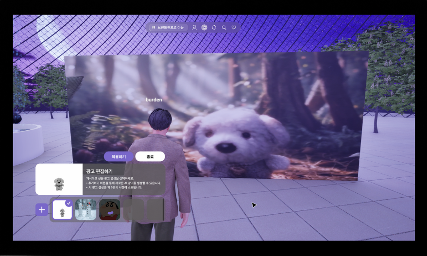

# 🦄 Unicorn AI 광고 생성 서버

스타트업을 위한 좌담회 플랫폼 **Unicorn**의 AI 광고 생성 서버입니다. 이 서버는 이미지와 텍스트 프롬프트를 입력받아 고품질의 광고 영상을 자동으로 생성합니다.



*AI 광고 생성 플랫폼의 사용자 인터페이스 - 3D 가상 공간에서 광고 편집 및 생성 기능을 제공합니다.*


## 🚀 주요 기능

- **AI 이미지 생성**: ComfyUI를 활용한 고품질 이미지 생성
- **AI 영상 생성**: CogVideoX 모델을 사용한 이미지-투-비디오 변환
- **자동 프롬프트 최적화**: Ollama를 통한 광고 프롬프트 자동 생성 및 요약
- **S3 클라우드 저장**: 생성된 미디어 파일의 자동 업로드
- **RESTful API**: FastAPI 기반의 효율적인 API 서비스

## 🏗️ 시스템 아키텍처

```
┌─────────────────┐    ┌─────────────────┐    ┌─────────────────┐
│   FastAPI App   │───▶│   ComfyUI API   │───▶│   AI Models     │
│   (Main Server) │    │   (Image Gen)   │    │   (SD, CogVideo)│
└─────────────────┘    └─────────────────┘    └─────────────────┘
         │                       │                       │
         ▼                       ▼                       ▼
┌─────────────────┐    ┌─────────────────┐    ┌─────────────────┐
│   S3 Upload     │    │   Ollama API    │    │   File Storage  │
│   (Cloud)       │    │   (Prompt Gen)  │    │   (Local)       │
└─────────────────┘    └─────────────────┘    └─────────────────┘
```

## 📁 프로젝트 구조

```
advertisement-generate-model/
├── app.py                 # FastAPI 메인 애플리케이션
├── comfyUIApi.py          # ComfyUI API 통합 (deprecated)
├── comfyApi/
│   ├── img2img.py         # 이미지 생성 모듈
│   └── img2vid.py         # 비디오 생성 모듈
├── utils/
│   ├── get_s3.py          # S3 다운로드 유틸리티
│   └── upload_s3.py       # S3 업로드 유틸리티
└── templates/             # HTML 템플릿 파일들
```

## 🛠️ 기술 스택

### Backend
- **FastAPI**: 고성능 웹 프레임워크
- **ComfyUI**: AI 이미지/비디오 생성 엔진
- **Ollama**: 로컬 LLM 프롬프트 생성
- **WebSocket**: 실시간 통신

### AI Models
- **Stable Diffusion**: 이미지 생성 (epicrealism_naturalSinRC1VAE)
- **CogVideoX**: 이미지-투-비디오 변환
- **IC-Light**: 조명 조정
- **IP-Adapter**: 이미지 참조 생성

### Cloud & Storage
- **AWS S3**: 클라우드 파일 저장
- **boto3**: AWS SDK

## 🚀 설치 및 실행

### 1. 환경 설정

```bash
# 저장소 클론
git clone [repository-url]
cd advertisement-generate-model

# 가상환경 생성 및 활성화
python -m venv venv
source venv/bin/activate  # Windows: venv\Scripts\activate

# 의존성 설치
pip install -r requirements.txt
```

### 2. 환경 변수 설정

`.env` 파일을 생성하고 다음 변수들을 설정하세요:

```env
AWS_ACCESS_KEY_ID=your_aws_access_key
AWS_SECRET_ACCESS_KEY=your_aws_secret_key
AWS_DEFAULT_REGION=your_aws_region
```

### 3. ComfyUI 서버 실행

```bash
# ComfyUI 서버 실행 (포트 8189)
python -m comfyui --port 8189

# 비디오 생성용 ComfyUI 서버 실행 (포트 8190)
python -m comfyui --port 8190
```

### 4. Ollama 서버 실행

```bash
# Ollama 서버 실행 (포트 11434)
ollama serve
```

### 5. 메인 애플리케이션 실행

```bash
# FastAPI 서버 실행
uvicorn app:app --host 0.0.0.0 --port 8000 --reload
```

## 📡 API 사용법

### 광고 영상 생성

```http
POST /generate-videoad
Content-Type: application/json

{
  "image": "https://example.com/product-image.jpg",
  "prompt": "자연친화적인 제품 광고, 따뜻한 조명과 부드러운 분위기",
  "adId": 12345
}
```

#### 응답 예시

```json
{
  "result": "광고 생성이 성공적으로 완료되었습니다.",
  "preview_url": "https://s3.amazonaws.com/bucket/preview-image.jpg",
  "video_url": "https://s3.amazonaws.com/bucket/generated-video.mp4"
}
```

## 🔧 주요 모듈 설명

### `app.py`
- FastAPI 메인 애플리케이션
- `/generate-videoad` 엔드포인트 제공
- 전체 광고 생성 워크플로우 관리

### `comfyApi/img2img.py`
- ComfyUI를 통한 이미지 생성
- 배경 제거, 조명 조정, 프롬프트 최적화
- Ollama를 통한 자동 프롬프트 생성

### `comfyApi/img2vid.py`
- CogVideoX 모델을 사용한 비디오 생성
- 이미지-투-비디오 변환
- 720x480 해상도, 8fps 설정

### `utils/upload_s3.py`
- S3 클라우드 저장소 업로드
- 광고 미리보기 이미지 및 비디오 업로드
- HTTP API를 통한 메타데이터 전송

## 🎯 워크플로우

1. **이미지 입력**: 사용자가 제품 이미지와 프롬프트 제공
2. **이미지 처리**: 배경 제거, 조명 조정, 품질 향상
3. **프롬프트 최적화**: Ollama를 통한 광고 프롬프트 자동 생성
4. **비디오 생성**: CogVideoX를 통한 이미지-투-비디오 변환
5. **클라우드 업로드**: S3에 미디어 파일 저장 및 메타데이터 전송

## 🔍 로깅

애플리케이션은 `app.log` 파일에 상세한 로그를 기록합니다:

```python
logging.basicConfig(
    filename='app.log',
    filemode='a',
    level=logging.INFO,
    encoding='utf-8-sig',
    format='%(asctime)s - %(levelname)s - %(message)s'
)
```


## 📞 문의

프로젝트에 대한 문의사항이 있으시면 이슈를 생성해 주세요.

---

**Unicorn AI 광고 생성 서버** - 스타트업을 위한 혁신적인 AI 광고 솔루션 🦄✨